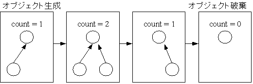
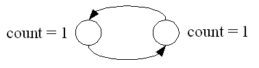
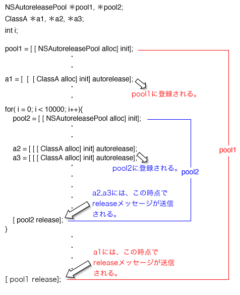

1.2 メモリ管理/ 参照カウント
=========================
- 1.2 章は ARC のベースとなる参照カウントによるメモリ管理の解説。

## 1.2.1 概要

- 参照カウント方式のメモリ管理の図。



参考: <http://www.net.c.dendai.ac.jp/~takumi/>

- 参照カウント方式の利点
	- 処理が高速。
	- 手動の管理と同様に、参照されなくなった時点で即座にオブジェクトの開放が行われる。
	- 記憶領域管理以外のリソース管理にも利用ができる。(File、mutexなど)
- 参照カウント方式の欠点
	- 整数値を付加するため領域のオーバーヘッドが生じる。
	- 参照カウントのオーバーフローを考慮する必要がある。
	- 循環参照が起こった場合に回収が行われない。



### 1.2.2 メモリ管理の考え方

- カウント自体を意識する必要はない。
- 意識するのは以下の操作。
	1. 生成+所有 (alloc) ... 生成と同時に参照カウンタを 1 にする。
	2. 所有 (retain) ... カウンタを増分。
	3. 解放 (release) ... カウンタを減分。0 になると破棄。
	4. 破棄時の処理の実装 (dealloc) ... デストラクタ
- 実は参照カウンタによるメモリ管理は言語の仕組みではなく、Cocoa フレームワークの決め事。
	- NSObject に alloc, retain, release, dealloc が実装されている。
	- NSObject はCocoa フレームワークの Foundation フレームワークのクラス。
	- 言語の仕組みじゃないのにコンパイラオプションで ARC が適用されるのは何故？？？
-  生成+所有を行うメソッド群
	- alloc
	- new ... alloc + init
	- copy
	- mutableCopy
- 命名規則
	- 先頭が alloc/new/copy/mutableCopy で始まる名前のメソッドは生成+所有を行う。
		- allocMyObject
		- newThatObject
		- copyThis
		- mutableCopyYourObject
	- 名前はキャメルケース。

- autorelease
	- 生成後、所有したくないオブジェクトに対して呼ぶ。
	- autoreleasepool の解放時に自動的に release が呼ばれる。
	- P12.図1.6 参照

オブジェクトを所有しないメソッドの例。
```
- (id)object
{
	id obj = [[NSObject alloc] init];
	[obj autorelease]; // !!! autoreleasepool に登録 !!!
	return obj;
}
```

呼び出し側で保有する場合は retain を呼ぶ必要がある。
```
id obj1 = [obj0 object];
[obj1 retain];
```

### 1.2.3 alloc/retain/release/dealloc の実装

- Apple Open Source (<http://opensource.apple.com/>) で一部のコードが公開されている。
- NSObject (Foundation フレームワーク) は公開されていないので、ここではオープンソースの GNUstep (<http://gnustep.org/>) の実装を参考に説明している。

#### alloc の実装 (簡略化後のコード)

```
struct obj_layout {
NSUInteger retained;
};
+ (id) alloc
{
int size = sizeof(struct obj_layout) + オブジェクトサイズ;
struct obj_layout *p = (struct obj_layout *)calloc(1, size);
return (id)(p + 1);
}
```

- 解説
	1. カウンタ + オブジェクトサイズ分の領域を割り当て。
	2. カウンタ分のサイズをスキップしたアドレスを void ポインタ (id) として返す。
	3. alloc で参照カウントは 1 になる…と言われてるけど、実は内部のカウンタは 0 になっている。
	- P.16 図 1.8 参照

- 参照カウント数は、retainCount インスタンスメソッドで取得
	- retainCount で内部のカウンタ +1 を参照カウントとして返している。(下記コードを参照)

#### retainCount の実装
```
- (NSUInteger) retainCount
{
	return NSExtraRefCount(self) + 1;
}
inline NSUInteger
NSExtraRefCount(id anObject)
{
	return ((struct obj_layout *)anObject)[-1].retained;
}
```

#### retain の実装
```
- (id) retain
{
	NSIncrementExtraRefCount(self);
	return self;
}
inline void
NSIncrementExtraRefCount(id anObject)
{
	if (((struct obj_layout *)anObject)[-1].retained == UINT_MAX - 1)
		[NSException raise: NSInternalInconsistencyException
			format: @"NSIncrementExtraRefCount() asked to increment too far"];
	((struct obj_layout *)anObject)[-1].retained++;
}
```

#### release の実装
```
- (void) release
{
	if (NSDecrementExtraRefCountWasZero(self))
		[self dealloc];
}
BOOL
NSDecrementExtraRefCountWasZero(id anObject)
{
	if (((struct obj_layout *)anObject)[-1].retained == 0) {
		return YES;
	} else {
		((struct obj_layout *)anObject)[-1].retained--;
		return NO;
	}
}
```

#### dealloc の実装
```
- (void) dealloc
{
	NSDeallocateObject (self);
}
inline void
NSDeallocateObject(id anObject)
{
	struct obj_layout *o = &((struct obj_layout *)anObject)[-1];
	free(o);
}
```

### 1.2.4 Apple による実装

- 書籍では Apple の実装をデバッガで追っているが、ここでは省略。
- Apple の実装では参照カウンタをハッシュテーブルで管理している。
- CF/CFRuntime.c __CFDoExternRefOperation
```
int __CFDoExternRefOperation(uintptr_t op, id obj) {
	CFBasicHashRef table = オブジェクトからハッシュテーブル取得(obj);
	int count;
	switch (op) {
	case OPERATION_retainCount:
		count = CFBasicHashGetCountOfKey(table, obj);
		return count;
	case OPERATION_retain:
		CFBasicHashAddValue(table, obj);
		return obj;
	case OPERATION_release:
		count = CFBasicHashRemoveValue(table, obj);
		return 0 == count;
	}
}  
```
- P22. 図1.10 参照。
- 参照カウント等の管理情報をメモリブロックと別領域のテーブルに持つことでメモリ破壊に強くなる。
	- 管理情報テーブルからメモリブロックのアドレスに到達可能。(P23. 図1.11 参照)
	- データ書き込みでオーバーランしても管理情報が破壊されない。


### 1.2.5 autorelease

- ローカル変数がスコープを抜けると解放されるように、NSAutoreleasePool の生存範囲を抜けたときにオブジェクトを解放する仕組み。
- P.24 図1.12 参照。
- コード例
```
NSAutoreleasePool *pool = [[NSAutoreleasePool alloc] init];
id obj = [[NSObject alloc] init];
[obj autorelease];
[pool drain];
```

- autorelease の呼び出しでオブジェクトが pool に登録される。
- pool が drain されると登録されたオブジェクトの release が呼ばれる。

- pool はネストが可能。



- Cocoa フレームワークでは NSRunLoop 等で適宜 NSAutoreleasePool の生成と破棄を行っている。
	- P25 図1.13 参照。
	- なので、保持しない一時的なオブジェクトは autorelease を呼んでおけば自分のコードを抜けたところで随時 release される。
	- とはいえ、画像等の大きなデータを扱うときは適宜 release すべき。
	- autoreleae されてるオブジェクトとそうでないオブジェクトが混ざってるとかなり混乱しそう。。。

### 1.2.6 autorelease の実装

- ここでも GNUstep の実装をベースに簡略化したコードを例に説明している。

#### autorelease
```
- (id) autorelease
{
	[NSAutoreleasePool addObject:self];
}
```

#### NSAutoreleasePool.m addObject
```
+ (void) addObject: (id)anObj
{
	NSAutoreleasePool *pool = 現在使用中のNSAutoreleasePool オブジェクトを取得;
	if (pool != nil) {
		[pool addObject:anObj];
	} else {
		NSLog(@"NSAutoreleasePool オブジェクトがない状態でautorelease が呼ばれた");
	}
}
```

#### Source/NSAutoreleasePool.m addObject
```
- (void) addObject: (id)anObj
{
	[array addObject:anObj];
}
```

#### Source/NSAutoreleasePool.m drain
```
- (void) drain
{
	[self dealloc];
}
- (void) dealloc
{
	[self emptyPool];
	[array release];
}
- (void) emptyPool
{
	for (id obj in array) {
		[obj release];
	}
}
```

### 1.2.7 Apple による実装

- objc4 ライブラリのruntime/objc-arr.mm にある AutoreleasePoolPage クラスで実装。
	- *.mm は C++ のコード。
- NSAutoreleasePool はネストできるので、生成・破棄には push/pop が呼ばれる。

#### AutoreleasePoolPage
```
class AutoreleasePoolPage
{
	static inline void *push()
	{
		NSAutoreleasePool クラスのオブジェクトの生成/所有に相当;
	}
	static inline void pop(void *token)
	{
		NSAutoreleasePool クラスのオブジェクトの破棄に相当;
		releaseAll();
	}
	static inline id autorelease(id obj)
	{
		NSAutoreleasePool クラスのaddObject クラスメソッドに相当
		AutoreleasePoolPage *autoreleasePoolPage =
		現在使用中のAutoreleasePoolPage インスタンスを取得;
		autoreleasePoolPage->add(obj);
	}
	id *add(id obj)
	{
		内部配列にオブジェクトを追加;
	}
	void releaseAll()
	{
		内部配列中のオブジェクトのrelease インスタンスメソッドを呼び出し;
	}
};
void *objc_autoreleasePoolPush(void)
{
	return AutoreleasePoolPage::push();
}
void objc_autoreleasePoolPop(void *ctxt)
{
	AutoreleasePoolPage::pop(ctxt);
}
id objc_autorelease(id obj)
{
	return AutoreleasePoolPage::autorelease(obj);
}
```

- showPools
	- NSAutoreleasePool クラスのクラスメソッド。
	- 現在の NSAutoreleasePool の状況をコンソールに出力するデバッグ用メソッド。

