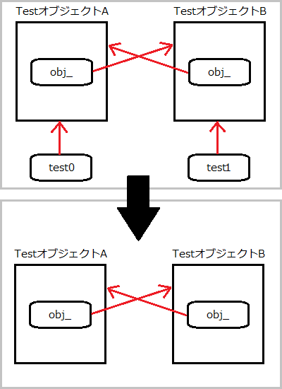

1.3 ARCのルール
========================================

1.3.1 概要
------------------------------

- 「参照カウントによるメモリ管理」を自動にするだけなので、根本は何も変わらない。
- ARCが有効になっているファイル、ARCが無効になっているファイルが混在できる。
    - ARCはコンパイル時に解決される

- ARCを有効化するための準備
    - clang 3.0以降を使う
    - コンパイラオプション「-fobjc-arc」を使う

Xcode 4.2ではデフォルトで有効。
(これ以降のソースコードは、特に明記がなければ、ARCが有効なコード。)

1.3.2 メモリ管理の考え方
------------------------------

ARCが有効でも、根本的なメモリ管理の考え方は変わらない。

> 自分が生成したオブジェクトの所有者は、自分である
>
> 自分が生成していないオブジェクトも、所有することができる
>
> 自分が所有しているオブジェクトが必要なくなったら、解放する
>
> 自分が所有してないオブジェクトを解放してはならない

1.3.3 所有修飾子
------------------------------

Objective-Cの変数型には大きく分けて2種類の型がある。

id型と各オブジェクト型。

id型は、C言語で言うところの「void *」に相当。

ARCが有効なときには、これらの2種類の型を使う際、所有修飾子を付与して宣言する必要がある。

- __strong
- __weak
- __unsafe_unretained
- __autoreleasing

### __strong 修飾子 ###

__strong 修飾子について、これから説明することのまとめ。

1. オブジェクト型にデフォルトで付与される
2. 変数が破棄されるときに、オブジェクトを解放してくれる
3. 変数に代入すると、オブジェクトを所有することになる
4. __strong修飾子の付いた変数同士で代入可能
5. クラスのメンバ変数も同様に、代入すると、オブジェクトを所有することになる
6. 変数の宣言時に何も代入しないと、NULLで初期化されることが保証されている
7. 循環参照が起きると、メモリリークの原因になることがある

#### 1. オブジェクト型にデフォルトで付与される ####

以下のソースコードの(1)と(2)は同じ。

    // (1)
    id obj = [[NSObject alloc] init];
    // (2)
    id __strong obj = [[NSObject alloc] init];

#### 2. 変数が破棄されるときに、オブジェクトを解放してくれる ####

以下のような、ARC有効時のソースコードがあったとする。

明示的に変数のスコープを意識したソースコードです。

    {
        id __strong obj = [[NSObject alloc] init];
    }

これを、ARC無効にしたときのソースコードに直すと、以下のようになる。

    // ARC無効
    {
        id obj = [[NSObject alloc] init];
        [obj release]
    }

objがスコープの終端に到達したとき、releaseするような振る舞いになる。

#### 3. 変数に代入すると、オブジェクトを所有することになる ####

以下のような、ARC有効時のソースコードがあったとする。

    {
        id __strong obj = [[NSObject alloc] init];
    }

オブジェクトの所有者を明確にすると、以下のようになる。

    {
        // オブジェクトを生成し、objが所有する
        id __strong obj = [[NSObject alloc] init];
        
        //
        // objが所有している状態
        //
    }
    // objが所有していたオブジェクトを解放し、所有者がいなくなる
    // 参照カウンタが0なので、オブジェクトが破棄される

ここで予備知識。

ARC無効時では、基本的に「alloc」「init」「new」「mutableCopy」「copy」という言葉が付いたメソッドは、オブジェクトを生成して、所有することができる。

しかし、それ以外のメソッドは、所有しないメソッドになる。(所有していないということは、いつの間にか別の所有者によって解放されていたりする。)

「[NSMutableArray array]」も、ARC無効時では所有しないメソッドになる。

そこで、以下のような、ARC有効時のソースコードがあったとする。

    {
        id __strong obj = [NSMutableArray array];
    }

オブジェクトの所有者を明確にすると、以下のようになる。

    {
        // オブジェクトを生成し、objが所有する
        id __strong obj = [NSMutableArray array];
        
        //
        // objが所有している状態
        //
    }
    // objが所有していたオブジェクトを解放
    // (参照カウンタが0ではないので、オブジェクトが破棄されることはない)

#### 4. __strong 修飾子の付いた変数同士でも代入可能 ####

以下のような、ARC有効時のソースコードがあったとする。

    id __strong obj0 = [[NSObject alloc] init];
    id __strong obj1 = [[NSObject alloc] init];
    id __strong obj2 = nil;
    obj0 = obj1;
    obj2 = obj0;
    obj0 = nil;
    obj2 = nil;

このソースコードを詳細に追っていくと、以下のようになる

    id __strong obj0 = [[NSObject alloc] init];
    // obj0がオブジェクトAへの強い参照を所有
    id __strong obj1 = [[NSObject alloc] init];
    // obj1がオブジェクトBへの強い参照を所有
    id __strong obj2 = nil;
    // obj2は何も所有していない
    obj0 = obj1;
    // obj0がオブジェクトBを所有 (2人目の所有者)
    // もともと所有していたオブジェクトAは所有者がいなくなり、破棄
    obj2 = obj0;
    // obj2がオブジェクトBを所有 (3人目の所有者)
    obj1 = nil;
    // obj1がオブジェクトBを解放 (所有者が2人に)
    obj0 = nil;
    // obj0がオブジェクトBを解放 (所有者が1人に)
    obj2 = nil;
    // obj2がオブジェクトBを解放
    // オブジェクトBは所有者0人で、破棄される

#### 5. クラスのメンバ変数も同様に、代入すると、オブジェクトを所有することになる ####

以下のような、ARC有効時のソースコードがあったとする。

    @interface Test : NSObject
    {
        id __strong obj_;
    }
    - (void)setObject:(id __strong)obj;
    @end
    
    @implementation Test
    - (id)init
    {
        self = [super init];
        return self;
    }
    
    - (void)setObject:(id __strong)obj
    {
        obj_ = obj;
    }
    @end

このクラスを以下のように利用してみる。

    {
        id __strong test = [[Test alloc] init];
        [test setObject:[[NSObject alloc] init]];
    }

このとき、メンバ変数の詳細な動きは以下のようになる。

    {
        id __strong test = [[Test alloc] init];
        // testがTestクラスのインスタンスを生成し、所有
        [test setObject:[[NSObject alloc] init]];
        // Testオブジェクトのobj_メンバが、NSObjectオブジェクトを生成、所有
    }
    // testがTestオブジェクトを解放し、所有者がいなくなったので破棄される
    // Testオブジェクトが破棄されることで、obj_メンバも破棄される
    // NSObjectオブジェクトを解放し、所有者がいなくなったので破棄される

#### 6. 変数の宣言時に何も代入しないと、NULLで初期化されることが保証されている ####

以下のようなソースコードがあったとする。

    id __strong obj0;
    id __weak obj1;
    id __autoreloeasing obj2;

このソースコードは、以下のソースコードと同じ。

    id __strong obj0 = nil;
    id __weak obj1 = nil;
    id __autoreloeasing obj2 = nil;

#### 7. 循環参照が起きると、メモリリークの原因になることがある ####

これについては、__weak 修飾子のところで解説。

#### __strong 修飾子のまとめ ####

__strong 修飾子により、retainとreleaseを書く必要がなくなった。

その上、「参照カウントによるメモリ管理の考え方」を満たしている。

- 自分が生成したオブジェクトの所有者は、自分である
- 自分が生成していないオブジェクトも、所有することができる
- 自分が所有しているオブジェクトが必要なくなったら、解放する
- 自分が所有してないオブジェクトを解放してはならない

__strong 修飾子、万歳！

### __weak 修飾子 ###

__weak 修飾子について、これから説明することのまとめ。

1. __strong 修飾子の循環参照
2. __weak 修飾子はオブジェクトを所有できない
3. クラスのメンバ変数に__weakを使うと循環参照されない
4. 弱参照しているオブジェクトが破棄されると、自動でNULLが代入される

#### 1. __strong 修飾子の循環参照 ####

循環参照を起こします。

以下のような、ARC有効時のソースコードがあったとする。

    @interface Test : NSObject
    {
        id __strong obj_;
    }
    - (void)setObject:(id __strong)obj;
    @end
    
    @implementation Test
    - (id)init
    {
        self = [super init];
        return self;
    }
    
    - (void)setObject:(id __strong)obj
    {
        obj_ = obj;
    }
    @end

これを使って、循環参照させる。

    {
        id test0 = [[Test alloc] init];
        id test1 = [[Test alloc] init];
        [test0 setObject:test1];
        [test1 setObject:test0];
    }

所有に関する動きを追ってみると、以下のようになる。

    {
        id test0 = [[Test alloc] init];
        // test0がTestオブジェクト0を生成し、所有する
        id test1 = [[Test alloc] init];
        // test1がTestオブジェクト1を生成し、所有する
        [test0 setObject:test1];
        // Testオブジェクト0のobj_がtest1を参照し、所有する
        [test1 setObject:test0];
        // Testオブジェクト1のobj_がtest0を参照し、所有する
    }
    // test0がTestオブジェクト0を解放
    // Testオブジェクト1のobj_が、まだTestオブジェクト0を所有しているので破棄されない
    // 
    // test1がTestオブジェクト1を解放
    // Testオブジェクト0のobj_が、まだTestオブジェクト1を所有しているので破棄されない
    //
    // メモリリーク!

実は、自らを参照するだけでも、循環参照になりうる。

以下が例。

    id test = [[Test alloc] init];
    [test setObject:test];

循環参照を解決するために利用するのが、__weak修飾子。

#### 2. __weak 修飾子はオブジェクトを所有できない ####

__weak 修飾子が付加された変数は、オブジェクトを所有できない。

以下のようなソースコードを書くと、コンパイルが警告を発する。

    id __weak obj = [[NSObject alloc] init];

理由は、生成されたオブジェクトを所有できないため、すぐさま解放、破棄されるため。

以下のように、いったん別の変数に所有させると、__weakな変数で弱い参照ができるようになる。

    {
        id __strong obj0 = [[NSObject alloc] init];
        id __weak obj1 = obj0;
    }

このソースコードの所有関係を詳細に見てみると、以下のようになる。

    {
        id __strong obj0 = [[NSObject alloc] init];
        // obj0が強い参照でNSObjectオブジェクトを生成、所有
        id __weak obj1 = obj0;
        // obj1がNSObjectオブジェクトの弱い参照をする
    }
    // obj0がNSObjectオブジェクトを解放し、自動的に破棄される
    // (obj1は所有していないので、特に関係なし)

#### 3. クラスのメンバ変数に__weakを使うと循環参照されない ####

これまででてきたTestクラスのメンバ変数を、__weakにしてみると循環参照されない。

#### 4. 弱参照しているオブジェクトが破棄されると、自動でNULLが代入される ####

弱参照しているオブジェクトが破棄されると、自動でNULLが代入される使用になっている。

    id __weak obj1 = nil;
    {
        id __strong obj0 = [[NSObject alloc] init];
        obj1 = obj0;
        NSLog(@"A: %@", obj0);
    }
    NSLog(@"B: %@", obj1);

上記のようなソースコードがあったとすると、最後のログの出力は以下のようになる。

    A: <NSObject: 0x753e180>
    B: (null)

C言語でmalloc、freeした後は、ポインタがNULLになったりしないので、まれに二重にfreeしてクラッシュする問題に遭遇することもあるが、__weakはNULLが代入されるので大変便利。

#### __weak 修飾子のまとめ ####

- 循環参照を防ぐことができる。
- オブジェクトが破棄されたら、自動でNULLが代入される。

ただし、iOS5 以降、OS X Lion 以降向けのアプリケーションでしか使用できない。

iOS4 対応、OS X Snow Leopard 対応アプリケーションでは、代わりに次の「__unsafe_unretained 修飾子」を使用する。

### __unsafe_unretained 修飾子 ###

__unsafe_unretained 修飾子付きの変数は、コンパイラによるメモリ管理対象から外される。

非常に危険なので、使うべきではない修飾子。

例えば、以下のようなソースコードがあったとする。

    id __unsafe_unretained obj1 = nil;
    {
        id __strong obj0 = [[NSObject alloc] init];
        obj1 = obj0;
        NSLog(@"A: %@", obj1);
    }
    NSLog(@"B: %@", obj1);

この出力は以下。

    A: <NSObject: 0x753e180>
    B: <NSObject: 0x753e180>

だがしかし、Bの出力はクラッシュしてもおかしくないコード。

    id __unsafe_unretained obj1 = nil;
    {
        id __strong obj0 = [[NSObject alloc] init];
        // obj0がNSObjectオブジェクトの強い参照を得る
        obj1 = obj0;
        // obj1はobj0から代入されるが、強い参照でも弱い参照でもないらしい……
        NSLog(@"A: %@", obj1);
    }
    // obj0がNSObjectオブジェクトを解放し、破棄される
    NSLog(@"B: %@", obj1);
    // obj1が示すオブジェクトはすでに破棄されているので、不正アクセスとなる

この修飾子を使っている場合は、なぜこの修飾子を使う必要があるのか、考え直したほうが良い。

#### __unsafe_unretained 修飾子のまとめ ####

もう使うべきではない修飾子。

### __autoreleasing 修飾子 ###

__autoreleasing 修飾子について、これから説明することのまとめ。

1. autoreleaseのコードが簡単に書き換えられるようになった
2. __autoreleasingを明示的に書く意味がない、いくつかの理由
    1. 「自分が生成し所有していないオブジェクトを取得する」場合
    2. __weak修飾子の場合
    3. id型のポインタとオブジェクト型のポインタの場合
    4. __autoreleasingの代入
3. @autoreleasepoolブロックはネストできる
4. @autoreleasepoolブロックは、ARC無効時でも使える

#### 1. autoreleaseのコードが簡単に書き換えられるようになった ####

ARC有効時には、autoreleaseとNSAutoreleasePoolクラスは使えない。

しかし、ARCが有効でも、autoreleaseの仕組み自体は生きている。

以下に、ARC無効時のソースコードのサンプルを提示する。

    /* ARC 無効*/
    NSAutoreleasePool *pool = [[NSAutoreleasePool alloc] init];
    id obj = [[NSObject alloc] init];
    [obj autorelease];
    [pool drain];

このコードはARC有効時に、以下のようなコードに置き換えられる。

    @autoreleasepool {
        id __autoreleasing obj = [[NSObject alloc] init];
    }

__autoreleasingと「@autoreleasepool」ブロックによって、非常にシンプルなコードに書き換えられるようになった。

#### 2. __autoreleasingを明示的に書く意味がない、いくつかの理由 ####

##### 1. 「自分が生成し所有していないオブジェクトを取得する」場合 #####

「自分が生成し所有していないオブジェクトを取得する」場合を考える。

この場合、alloc/new/copy/mutableCopyメソッド群以外のメソッドでオブジェクトを取得しているはず。

実はこのとき、ARC有効な状態であれば、コンパイラがメソッド名がalloc/new/copy/mutableCopyで始まっているかチェックして、そうであれば、自動的に戻り値のオブジェクトをautoreleasepoolに登録している。

以下のようなソースコードがあったとする。

    @autoreleasepool {
        id __strong obj = [NSMutableArray array]; // 自分が生成し所有していないオブジェクトを取得している
    }

    @autoreleasepool {
        id __strong obj = [NSMutableArray array];
        // objがNSMutableArrayオブジェクトを強い参照で所有
        //
        // コンパイラがメソッド名で判断し、autoreleaseに登録する
    }
    // objがNSMutableArrayオブジェクトを解放
    //
    // @autoreleasepoolブロックが終わったことで、autoreleaseに登録されているオブジェクトが解放
    //
    // NSMutableArrayオブジェクトは所有者がいなくなり、破棄される

このように、明示的に@autoreleasepoolブロックで囲まなくても、__strong修飾子の効果でオブジェクトが解放・破棄される。

##### 2. __weak修飾子の場合 #####

続いて、__weak修飾子の例。

    id __weak obj1 = obj0;
    NSLog(@"class=%@", [obj1 class]);

このソースコードは、以下のソースコードと等価。

    id __weak obj1 = obj0;
    id __autoreleasing tmp = obj1;
    NSLog(@"class=%@", [tmp class]);

実は、__weak修飾子付きの変数をアクセスする場合、必ずautoreleasepoolに登録されたオブジェクトとしてアクセスすることになる。

__weak修飾子はオブジェクトへの弱い参照しか持てないため、参照している最中にオブジェクトが破棄される可能性がある。

そのため、autoreleasepoolに登録されるらしい。

##### 3. id型のポインタとオブジェクト型のポインタの場合 #####

さらに、id型のポインタの例。

以下の(1)と(2)が等価なのは、前述の通り。

    // (1)
    id obj;
    // (2)
    id __strong obj;

以下の(1)と(2)も、実は等価。

    // (1)
    id *obj;
    // (2)
    id __autoreleasing *obj;

id型のポインタ型や、他のオブジェクトのポインタ型は、明示的に指定しない場合、__autoreleasingが付与される。

ここでNSErrorオブジェクトの話。

関数の戻り値とは別に、エラーの詳細を得るために、メソッドの引数にNSErrorオブジェクトのポインタを渡すことがよくあるらしい。

    NSError *error = nil;
    BOOL result = [obj performOperationWithError:&error];

このperformOperationWithErrorの宣言は、以下のようになっている。

    - (BOOL) performOperationWithError:(NSError **)error;

これは、明示的に書き換えると、以下のようになる。

    - (BOOL) performOperationWithError:(NSError * __autoreleasing *)error;

alloc/new/copy/mutableCopyメソッドは、「自分がオブジェクトを『生成』し『所有する』」必要がある。

それ以外のメソッドは、「自分が『生成』し『所有していない』オブジェクトを取得する」挙動にならなければいけない。

performOperationWithErrorは、それと同様の挙動にするため、__autoreleasingなオブジェクトを引数で渡すようにしている。

##### 4. __autoreleasingの代入 #####

以下のようなソースコードがあったとする。

    NSError *error = nil;
    NSError **pError = &error;

これはコンパイル・エラーになる。

オブジェクトのポインタ型への代入は、修飾子が揃っていなくてはいけない。

    NSError *error = nil;
    NSError * __strong *pError = &error;
    
    NSError __weak *error = nil;
    NSError * __weak *pError = &error;
    
    NSError __unsafe_unretained *unsafeError = nil;
    NSError * __unsafe_unretained *pUnsafeError = &unsafeError;

しかし、以下のソースコードはコンパイルが通る。

    NSError __strong *error = nil;
    BOOL result = [obj performOperationWithError:&error];

なぜならコンパイラが、以下のようにソースコードを置き換えているから。

    NSError __strong *error = nil;
    NSError __autoreleasing *tmp = error;
    BOOL result = [obj performOperationWithError:&tmp];
    error = tmp;

#### 3. @autoreleasepoolブロックはネストできる ####

@autoreleasepoolブロックはネストできる。

    @autoreleasepool {
        @autoreleasepool {
            @autoreleasepool {
                id __autoreleasing obj = [[NSObject alloc] init];
            }
        }
    }

#### 4. @autoreleasepoolブロックは、ARC無効時でも使える ####

LLVMコンパイラ3.0以降ならば、ARC無効でも@autoreleasepoolブロックを使える。

1.3.4 ルール
------------------------------

ARCを有効にしてコンパイルするとき、いくつかのルールを守らなければならない。

- retain/release/retainCount/autorelease は使用できない
- NSAllocateObject/NSDeallocateObject は使用できない
- メモリ管理に関するメソッド命名規則を守る
- 明示的にdealloc を呼び出せない
- NSAutoreleasePool の代わりに@autoreleasepool ブロックを使用する
- ゾーン（NSZone）は使用できない
- オブジェクト型変数は、C 言語の構造体（struct/union）のメンバになれない
- 「id」と「void *」は明示的にキャストする

### retain/release/retainCount/autorelease は使用できない ###

AppleのARCに関する説明には、以下のような言葉がある。

> ARC を有効にすると、retain またはrelease を再度タイプする必要がなくなり

逆を言えば、retainやreleaseを行おうとすると、コンパイラがエラーを吐くことになる。

### NSAllocateObject/NSDeallocateObject は使用できない ###

通常、オブジェクトを生成し、所有するときには、allocメソッドを呼び出す。

ARC無効時では、NSAllocateObjectを呼び出すことでも同様のことができた。

しかしこれも、ARC有効時ではエラーになる。

オブジェクトを解放するために、NSDeallocateObjectを使うこともエラーになる。

### メモリ管理に関するメソッド命名規則を守る ###

ARC無効時では、オブジェクトの生成・所有に関連するメソッドには、以下のような命名規則を守る必要があった。

- alloc
- new
- copy
- mutableCopy

これはARC有効時でも同様。

さらに、「init」で始まるメソッド名にはさらに厳格なルールがある。

「init」で始まるメソッド名は、インスタンスメソッドでなけらばならず、返値がid型かそのクラスのオブジェクト型、もしくはそのクラスのスーパークラスかサブクラスのオブジェクト型でなければならない。

### 明示的にdealloc を呼び出せない ###

ARCによって自動で対処されるため、明示的にdeallocを呼ぶことができない。

deallocすると、コンパイル・エラーとなる。

### NSAutoreleasePool の代わりに@autoreleasepool ブロックを使用する ###

ARC有効時には__autoreleasingを使うことになり、NSAutoreleasePoolを使おうとするとコンパイル・エラーになる。

### ゾーン（NSZone）は使用できない ###

ARC有効・無効に関わらず、現在のランタイムシステムでは、ゾーンが無視されている。

そのため、書いても意味がない。

### オブジェクト型変数は、C 言語の構造体（struct/union）のメンバになれない ###

C言語の構造体(structまたはunion)のメンバに、Objective-Cのオブジェクト型の変数を記述すると、コンパイルエラーになる。

理由は、C言語の規格上、構造体のメンバに対する寿命を管理する方法が存在しないため。

ARCでは、メモリ管理をコンパイラの仕事にさせるために、コンパイラがオブジェクトの寿命を理解、管理できる必要がある。

しかし、それができないので、コンパイル・エラーにするしかないのだろう……。

どうしても構造体のメンバにする必要があるときには、「void *」にキャストするか、__unsafe_unretained修飾子を使う必要がある。

### 「id」と「void *」は明示的にキャストする ###

ARC無効時は、id型から「viod *」型への代入は、問題なくできていた。

しかし、ARC有効時はコンパイル・エラーになる。

#### __bridgeキャスト ####

単に代入するだけならば、__bridgeキャストを使う。

    id obj = [[NSObject alloc] init];
    void *p = (__bridge void *)obj;
    id o = (__bridge id)p;

ただし、「void *」への代入は、__unsafe_unretained修飾子への代入と同じくらい危険。

#### __bridge_retainedキャスト ####

代入したキャスト先の変数が、まるで代入されたオブジェクトを所有するような動作になる。

    id obj = [[NSObject alloc] init];
    void *p = (__bridge_retained void *)obj;

以下がARC無効時のソースコード。

    /* ARC 無効*/
    id obj = [[NSObject alloc] init];
    void *p = obj;
    [(id)p retain]; // 参照カウンタがインクリメントされる

#### __bridge_transferキャスト ####

__bridge_transferを使うと、代入後に解放する挙動になる。

    id obj = (__bridge_transfer id)p;

以下がARC無効時のソースコード。

    /* ARC 無効*/
    id obj = (id)p;
    [obj retain];
    [(id)p release];

#### Objective-C のオブジェクトと、Core Foundation オブジェクトとの相互変換 ####

これらのキャストは、Objective-Cのオブジェクトと、Core Foundationオブジェクトとの相互変換で利用される。

ちなみに、Core Foundationとは、CocoaのFoundationに相当するものをC言語で記述したもの。(from Wikipedia)

Objective-Cのオブジェクトと、Core Foundationオブジェクトとの相互変換を、「交通料金無料の橋(Toll-Free Bridge)」と呼んだりするらしい。

Toll-Free Bridgeのキャスト用に以下の関数が用意されている。

    CFTypeRef CFBridgingRetain(id X) {
        return (__bridge_retained CFTypeRef)X;
    }
    
    id CFBridgingRelease(CFTypeRef X) {
        return (__bridge_transfer id)X;
    }

Objective-Cで生成したオブジェクトを、Core Foundationで解放することもでき、また逆も可能。

CFBridgingRetainやCFBridgingReleaseの代わりに、以下のキャストを使っても良い。

- __bridge_retain
- __bridge_transfer

一つサンプル・コードを見ておく。

    CFMutableArrayRef cfObject = NULL;
    {
        id obj = [[NSMutableArray alloc] init];
        // 変数obj が、生成し所有したオブジェクトへの強い参照を持っている
        cfObject = CFBridgingRetain(obj); // 参照カウントがインクリメント
        // CFBridgingRetainにより、オブジェクトをCFRetainして変数cfObjectに代入したと見なせる
        CFShow(cfObject);
        printf("retain count = %dYn", CFGetRetainCount(cfObject));
        // NSMutableArrayオブジェクトの参照カウントは2
    }
    // objがNSMutableArrayオブジェクトを解放
    // 参照カウンタが1になる
    printf("retain count after the scope = %dYn", CFGetRetainCount(cfObject));
    CFRelease(cfObject);
    // オブジェクトが解放され、参照カウンタが0に
    // オブジェクトが破棄される

このソースコードがCFBridgeingRetainではなく、ただの__bridgeだった場合、参照カウンタがインクリメントされないため、CFReleaseするときにはすでにオブジェクトが破棄されて、エラーになってしまう。

    {
        CFMutableArrayRef cfObject = CFArrayCreateMutable(kCFAllocatorDefault, 0, NULL);
        printf("retain count = %dYn", CFGetRetainCount(cfObject));
	// Core FoundationフレームワークのAPI で生成し所有した直後のオブジェクトの参照カウントは1
        id obj = CFBridgingRelease(cfObject);
        // CFBridgingReleaseによる代入により、変数obj による強い参照とCFReleaseによる解放が同時に発生する
        printf("retain count after the cast = %dYn", CFGetRetainCount(cfObject));
        
        // 変数obj だけが、生成し所有したオブジェクトへの強い参照を持っているため、参照カウントは1
        
        NSLog(@"class=%@", obj);
    }
    // スコープを超えたため、強い参照が消滅、オブジェクトは解放し、破棄される

このソースコードがCFBridgingReleaseではなく、ただの__bridgeだった場合、代入元のcfObjectが所有し続けるため、スコープを超えても依然として参照カウンタが1になってしまい、メモリリークを起こしてしまう。

1.3.5 プロパティ
------------------------------

ちなみにプロパティとは。

クラスのインスタンス変数にアクセスする際、getterやsetterといったアクセッサ・メソッドを作って、それ経由でデータをやりとりするが、そのアクセッサ・メソッドを自動生成してくれる仕組みがある。

それがプロパティ。

ARCが有効な場合、プロパティでも属性に変化が現れる。

プロパティの例。

    @property (nonatomic, strong) NSString *name;

プロパティの属性と所有修飾子

- assign: __unsafe_unretained修飾子
- copy: __strong修飾子 (ただしコピーされたオブジェクトが代入される)
- retain: __strong修飾子
- strong: __strong修飾子
- unsafe_unretained: __unsafe_unretained修飾子
- weak: __weak修飾子

クラスのメンバ変数も宣言する場合、プロパティの属性と揃っていないとコンパイルできない。

例えば、以下のような宣言があるとする。

    id obj;

これを以下のような、__weakで宣言すると、コンパイル・エラーが起きる。

    @property (nonatomic, weak) id obj;

修飾子をそろえる必要がある。

1.3.6 配列
------------------------------

### 配列の宣言でも__strong修飾子は勝手に補完 ###

__strong修飾子は勝手に補完されるので、以下のように書けば大丈夫。

    id objs[10];

その他の修飾子は、明示的に指定する。

### NULL初期化 ###

以下の修飾子付きの変数の配列は、配列宣言時NULL初期化が保証されている。

- __strong
- __weak
- __autoreleasing

ただし、__unsafe_unretainedは保証されていないので注意。

### 動的な配列

__strong 修飾子付き変数を、動的な配列として使用するときには、NSMutableArray、NSMutableDictionary、NSMutableSet などのFoundationフレームワークのコンテナを使うべき。適切に管理してくれる。

しかし、いくつかの問題が存在する。

以下のソースコードに注目。

    id __strong *array = nil;

id型のポインタは明示的に指示しなければ__autoreseasingになる。

__strongを付加することで、強い参照を得ることができる。

しかし、__strong修飾子付きid型のポインタはNULL初期化が保証されていないので注意。

また、callocを使って確保する場合は、以下のように行う。

    array = (id __strong *)calloc(entries, sizeof(id));

mallocしたあとに、memsetで0埋めしても良い。

ただし、mallocで確保した配列の各要素にNULLを代入して初期化するのは危険。

    array = (id __strong *)malloc(sizeof(id) * entries);
    for (NSUInteger i = 0; i < entries; ++i)
        array[i] = nil;

mallocで確保したメモリが0で初期化されていないため、不定なアドレスが代入された__strong修飾子付き変数に対する代入になる。

存在しないオブジェクトに対して解放する処理が実行される。

また、配列のメモリ解放を行う際には、以下のように配列の中身を解放してから、本体を解放する。

    for (NSUInteger i = 0; i < entries; ++i)
        array[i] = nil;
    free(array);

また、memcpyで配列をコピーすることや、reallocで配列を再配置することも危険。
